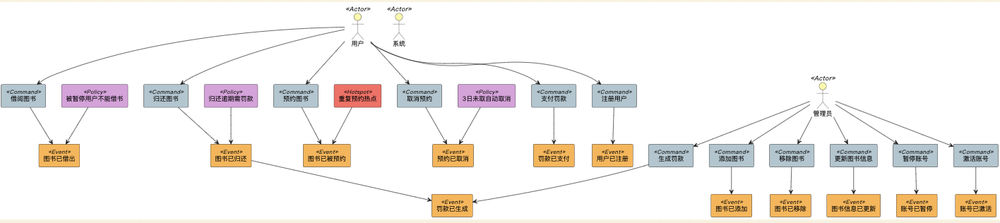

# 图书管理系统-事件风暴建模

## 第一步：识别核心要素

### 领域事件（Domain Events，使用过去式描述的业务事实）

- 图书已借出
- 图书已归还
- 图书已被预约
- 预约已取消
- 罚款已生成
- 罚款已支付
- 图书已添加
- 图书已移除
- 图书信息已更新
- 用户已注册
- 用户账号已被暂停
- 用户账号已重新激活

### 命令（Commands，使用现在式动词表示的行为）

- 借阅图书
- 归还图书
- 预约图书
- 取消预约
- 生成罚款
- 支付罚款
- 添加图书
- 移除图书
- 更新图书信息
- 注册用户
- 暂停用户账号
- 激活用户账号

### 行为者（Actors）

- 图书管理员（Librarian）
- 图书馆用户（Member）
- 图书馆系统（自动）（Library System）

### 热点（Hotspots）

- 同一本图书重复预约的处理规则
- 罚款计算规则（如：宽限期、每日罚金等）
- 图书可用性校验逻辑的复杂度

### 策略（Policies）

- 如果图书逾期归还，则必须生成罚款
- 如果预约图书在3日内未取走，自动取消预约
- 被暂停的用户无法借阅或预约图书

---

## 第二步：事件驱动的二元有向元组列表

```text

[Actor: 用户, Command: 借阅图书]
[Command: 借阅图书, Event: 图书已借出]
[Policy: 被暂停的用户无法借阅图书, Event: 图书已借出]

[Actor: 用户, Command: 归还图书]
[Command: 归还图书, Event: 图书已归还]
[Policy: 图书逾期归还必须生成罚款, Event: 图书已归还]
[Event: 图书已归还, Event: 罚款已生成]

[Actor: 用户, Command: 预约图书]
[Command: 预约图书, Event: 图书已被预约]
[Hotspot: 同一本图书重复预约的处理规则, Event: 图书已被预约]

[Actor: 用户, Command: 取消预约]
[Command: 取消预约, Event: 预约已取消]

[Actor: 管理员, Command: 生成罚款]
[Command: 生成罚款, Event: 罚款已生成]

[Actor: 用户, Command: 支付罚款]
[Command: 支付罚款, Event: 罚款已支付]

[Actor: 管理员, Command: 添加图书]
[Command: 添加图书, Event: 图书已添加]

[Actor: 管理员, Command: 移除图书]
[Command: 移除图书, Event: 图书已移除]

[Actor: 管理员, Command: 更新图书信息]
[Command: 更新图书信息, Event: 图书信息已更新]

[Actor: 用户, Command: 注册用户]
[Command: 注册用户, Event: 用户已注册]

[Actor: 管理员, Command: 暂停用户账号]
[Command: 暂停用户账号, Event: 用户账号已被暂停]

[Actor: 管理员, Command: 激活用户账号]
[Command: 激活用户账号, Event: 用户账号已重新激活]

[Policy: 预约图书在3日内未取走，自动取消预约, Event: 预约已取消]
```


## 第三步：基于事件流的PlantUML可视化建模

### 图例：颜色标识

* 🟧 领域事件：橙色
* 🟦 命令：蓝色
* 🟨 行为者：黄色
* 🔴 热点：红色
* 🟪 策略：紫色

```plantuml
@startuml
skinparam style strict
skinparam rectangle {
  StereotypeFontColor black
  StereotypeFontSize 12
  BackgroundColor white
  BorderColor black
}

actor "用户" as Member <<Actor>> #FBF8A6
actor "管理员" as Librarian <<Actor>> #FBF8A6
actor "系统" as System <<Actor>> #FBF8A6

rectangle "借阅图书" as BorrowBook <<Command>> #AEC6CF
rectangle "图书已借出" as BookBorrowed <<Event>> #FFB347
rectangle "被暂停用户不能借书" as BorrowPolicy <<Policy>> #DDA0DD

rectangle "归还图书" as ReturnBook <<Command>> #AEC6CF
rectangle "图书已归还" as BookReturned <<Event>> #FFB347
rectangle "归还逾期需罚款" as FinePolicy <<Policy>> #DDA0DD
rectangle "罚款已生成" as FineIssued <<Event>> #FFB347

rectangle "预约图书" as ReserveBook <<Command>> #AEC6CF
rectangle "图书已被预约" as BookReserved <<Event>> #FFB347
rectangle "重复预约热点" as ReserveHotspot <<Hotspot>> #FF6961

rectangle "取消预约" as CancelReservation <<Command>> #AEC6CF
rectangle "预约已取消" as ReservationCancelled <<Event>> #FFB347
rectangle "3日未取自动取消" as CancelPolicy <<Policy>> #DDA0DD

rectangle "生成罚款" as IssueFine <<Command>> #AEC6CF
rectangle "支付罚款" as PayFine <<Command>> #AEC6CF
rectangle "罚款已支付" as FinePaid <<Event>> #FFB347

rectangle "添加图书" as AddBook <<Command>> #AEC6CF
rectangle "图书已添加" as BookAdded <<Event>> #FFB347

rectangle "移除图书" as RemoveBook <<Command>> #AEC6CF
rectangle "图书已移除" as BookRemoved <<Event>> #FFB347

rectangle "更新图书信息" as UpdateBookInfo <<Command>> #AEC6CF
rectangle "图书信息已更新" as BookInfoUpdated <<Event>> #FFB347

rectangle "注册用户" as RegisterUser <<Command>> #AEC6CF
rectangle "用户已注册" as UserRegistered <<Event>> #FFB347

rectangle "暂停账号" as SuspendUser <<Command>> #AEC6CF
rectangle "账号已暂停" as UserSuspended <<Event>> #FFB347

rectangle "激活账号" as ReactivateUser <<Command>> #AEC6CF
rectangle "账号已激活" as UserReactivated <<Event>> #FFB347

Member --> BorrowBook
BorrowBook --> BookBorrowed
BorrowPolicy --> BookBorrowed

Member --> ReturnBook
ReturnBook --> BookReturned
FinePolicy --> BookReturned
BookReturned --> FineIssued

Member --> ReserveBook
ReserveBook --> BookReserved
ReserveHotspot --> BookReserved

Member --> CancelReservation
CancelReservation --> ReservationCancelled
CancelPolicy --> ReservationCancelled

Librarian --> IssueFine
IssueFine --> FineIssued

Member --> PayFine
PayFine --> FinePaid

Librarian --> AddBook
AddBook --> BookAdded

Librarian --> RemoveBook
RemoveBook --> BookRemoved

Librarian --> UpdateBookInfo
UpdateBookInfo --> BookInfoUpdated

Member --> RegisterUser
RegisterUser --> UserRegistered

Librarian --> SuspendUser
SuspendUser --> UserSuspended

Librarian --> ReactivateUser
ReactivateUser --> UserReactivated
@enduml

```







ChatGPT4o 聊天记录
https://chatgpt.com/share/68373308-b45c-8005-8e66-56b729c666cc
